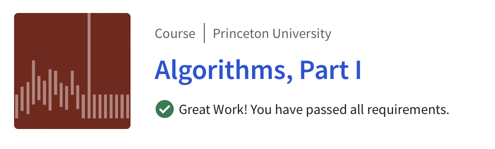
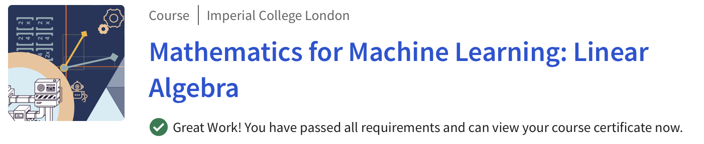
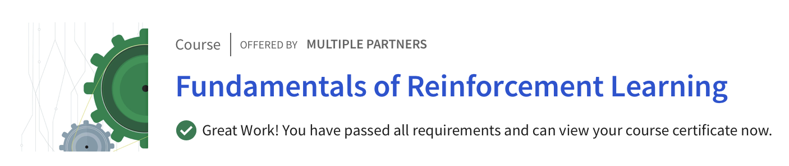
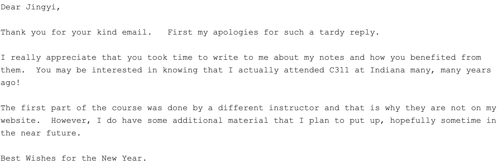

这是一个迟到的年度总结，敦促一下今年要多加努力！

# 人生总结

1. 不要向别人主动提供过分的帮助。
2. 努力扼制任何想炫耀的心。
3. 减少社交媒体宣传快乐的频率，人生应当是快乐和不快乐交织的。
4. 习惯向别人表达真诚的感谢

# 上课总结

今年上了不少的课，收获不小。不仅如此，上课让我英文水平得到了提高。我不再惧怕看英文的东西了，也养成了任何资源首先从英文世界获取的好习惯。

## Coursera

今年我花了很多很多的时间在Coursera上面。Coursera这个平台其实对萌新非常的友好，课程难度适中、课程视频长度适中，也有健全的评分系统能及时获得反馈。

### [Algorithms, Part I](https://www.coursera.org/learn/algorithms-part1) (2022年初)

2021年年末的时候我决心开始“刷题”，但是许久不碰算法的我需要一门课来回顾一下。我就上了这门各大论坛好评如潮的课程。课程的质量确实不错，作业难度也适中，对熟悉Java和算法是很好的方式。如果对于没有刷题压力的人来说，学习这门课我非常推荐；但是，这门课不教授如何做题，它强调的是理论分析和对高阶算法的介绍。此外比较遗憾的地方就是这门课不提供证书。

### [Mathematics for Machine Learning: Linear Algebra](https://www.coursera.org/learn/linear-algebra-machine-learning/home)  (2022年上半)

去年第一学期结束前，突然好奇觉得应该补一点线性代数的知识。我期望一个提供直觉和编程练习的课程，这门课非常好的满足了我的需求，内容非常简单，同时提供的直觉十分强烈，介绍了线性代数的本质线性变换，通俗地讲即原来是一条线变换到新的坐标系还是一条线。还是很不错的课程，也是我获得的第一个证书。

### [Fundamentals of Reinforcement Learning](https://www.coursera.org/learn/fundamentals-of-reinforcement-learning) (2022年末)

因为研究的需要，我开始学习强化学习有关的知识。这门课是 \<Reinforcement Learning: An Introduction\> 作者Sutton和他的学生们开的。课程时长其实非常的短，但前提是要求学生们都跟着课程一起读教材。我已经读过教材的Part1(Ch1 ~ Ch8)了，也就是tabular solution method的部分。所以省去了很多时间，看几遍视频就可以上手做作业了。作业难度适中，但帮助我更好地理解了许多算法。此外，看视频的同时我才意识到有许多隐藏在书本文字之下的逻辑和一些算法的实现细节，我猜测也许作者是为了推销课程故意把一些重要的部分放在课程里面了，我也只有上了课之后才了解到其中的奥妙。还是很推荐的。此外，读教材的时候也用了很多金子老师的[问题](https://lecture.ecc.u-tokyo.ac.jp/~ctkaneko/rlbook/)作为参考。

### [Sample-based Learning Methods](https://www.coursera.org/learn/sample-based-learning-methods) (2023年初)

这是前一门课的后续，同属Reinforcement Learning。我这周才刚刚完成所有的部分，与第一部分类似，仍然包含了许多隐藏在课本之下的逻辑，对于需要理解概念和建立直觉的入门者我而言是非常好的一门课。

## Open Course

### [IU C311/B521/A596 Programming Languages](https://cgi.luddy.indiana.edu/~c311/doku.php) (2022年末)

从大一看到王垠的博客的那时起就向往这门程序语言的入门课很久了，最近花了时间把前六课的作业做完。由于C311没有参考资料，我参考的是十年前的课程存档和[来自IIT教授Venkatesh Choppella的PoPL课程资料](https://faculty.iiit.ac.in/~venkatesh.choppella/popl/)，其中关于Lambda-calculus和CPS变换的部分笔记十分的精彩。前几个月我曾发邮件询问是否有课程前半部分的资料，遗憾的是前半部分不属于Choppella教授的内容，所以没有公开。（似乎私人邮件内容是可以公开的😌)

### [MIT Distributed Systems](https://pdos.csail.mit.edu/6.824/index.html) (2022年末)

这个是MIT分布式课程，我只做了第一课；实验部分量比较大，但要求老老实实看视频上课，不然做的时候会因为缺乏关键信息然后做的超级累。我不太喜欢几个小时几个小时的视频砸进去，所以暂时没有继续做了。

# 求职总结

求职是我去年的一个关键词，其中辛酸苦辣只有自己知道。我总结了今年需要做出改进的地方。

## 和非技术人员打交道
几番面试下来，让我清楚地认识到千万不要太相信中介和recruiter们的话，真正做决定的并不是他们。有几件事让我印象特别深刻：
1. 某个国际大公司的recruiter第四次ghost我，这一次是在信誓旦旦给了承诺之后。
2. 某个日本企业的recruiter无故ghost我2个月，期间一点联系也没有。
3. 某个求职机构极其不专业的联系方式，甚至在节假日给我连发几封错误的邮件。

除此之外还有许多事情，我认为这些都是非常不礼貌的行为。新的一年我要礼貌地拒绝傲慢无礼且毫无作用的联系。

## 实习

实习的生活是丰富多彩的，下面是一些很棒的收获：
1. 不要同一个问题对不同的人问。
2. 不要无条件依赖上司主管导师，他们和我的共同利益是有限的。
3. 不要对人做出不切实际或者无法兑现的承诺。
